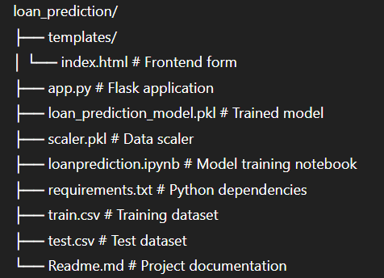
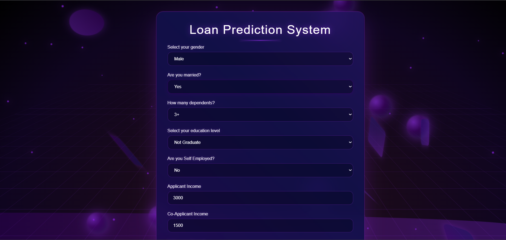

# Loan Prediction & Deployment Project

This project builds a machine learning model to predict whether a loan application will be approved. The model is trained on a historical dataset of loan applications and is deployed as a web application using the Flask framework.

---


## 📋 Table of Contents

- [Project Overview](#-project-overview)
- [Dataset](#-dataset)
- [Model](#-model)
- [File Structure](#-file-structure)
- [Setup & Installation](#%EF%B8%8F-setup--installation)
- [Usage](#%EF%B8%8F-usage)
- [Screenshots](#-screenshots)

---

## 📝 Project Overview

The goal of this project is to create a reliable predictor for loan approval. The process involves:

1. **Data Preprocessing** – Cleaning and preparing the raw data, including handling missing values and encoding categorical features.
2. **Model Training** – Training a Logistic Regression model on the processed data to learn the patterns associated with loan approval.
3. **Model Serialization** – Saving the trained model and the data scaler using `pickle` for later use in the application.
4. **Web Application** – Building a user-friendly web interface with Flask that takes user input and uses the saved model to provide a real-time prediction.

---

## 📊 Dataset

The dataset used for this project is the **Loan Prediction Problem Dataset** from Kaggle. It contains 13 columns detailing various attributes of loan applicants.

**Source:** [Kaggle Loan Prediction Dataset](https://www.kaggle.com/)  

### Key Features

- **Gender** – Applicant's gender.  
- **Married** – Marital status (Yes/No).  
- **Dependents** – Number of dependents.  
- **Education** – Education level (Graduate/Not Graduate).  
- **Self_Employed** – Whether the applicant is self-employed (Yes/No).  
- **ApplicantIncome** – Applicant's monthly income.  
- **CoapplicantIncome** – Co-applicant's monthly income.  
- **LoanAmount** – Loan amount in thousands.  
- **Loan_Amount_Term** – Loan term in months.  
- **Credit_History** – Good credit history (1 = Yes, 0 = No).  
- **Property_Area** – Property location (Urban/Semi-Urban/Rural).  
- **Loan_Status** – Target variable (Y = Approved, N = Not Approved).  

---

## 🤖 Model

A **Logistic Regression** model is used for this classification task.

### Training Process
- **Handling Missing Data** – Fill numerical null values with the median, categorical null values with the mode.  
- **Feature Encoding** – Convert categorical columns to numerical format using one-hot encoding.  
- **Data Scaling** – Standardize features using `StandardScaler` for optimal model performance.  
- **Training** – Train the model on preprocessed and scaled data.  

The trained model is saved as `loan_prediction_model.pkl` and the scaler as `scaler.pkl`.

---

## 📁 File Structure




---

## 🛠️ Setup & Installation

1. **Clone the Repository**
    ```bash
    git clone [your-repository-url]
    cd loan_prediction
    ```

2. **Create and Activate a Virtual Environment**  
    **Windows:**
    ```bash
    python -m venv venv
    venv\Scripts\activate
    ```
    **macOS/Linux:**
    ```bash
    python3 -m venv venv
    source venv/bin/activate
    ```

3. **Install Dependencies**
    ```bash
    pip install -r requirements.txt
    ```

4. **Generate Model and Scaler Files**  
   If `loan_prediction_model.pkl` and `scaler.pkl` are missing, run the `loanprediction.ipynb` notebook from start to finish to generate them.

---

## ▶️ Usage

1. **Start the Flask Server**
    ```bash
    python app.py
    ```

2. **Access the Application**  
   Open your browser and go to:
    ```
    http://127.0.0.1:5000
    ```
   Fill in the applicant details and click **"Predict Loan Approval"** to see the prediction.

---

## 📸 Screenshots



---
